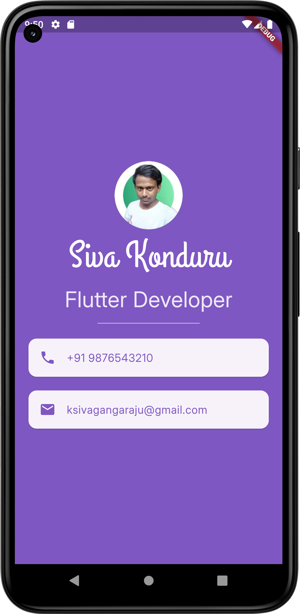

# Flutter ID Card App 📇

A simple digital ID card mobile application built using **Flutter** and **Dart**.  
This project is designed to practice the basics of Flutter UI widgets and layout structures.

## 🔧 Features

- Clean and minimal ID Card UI  
- Display user's name, profession, phone number, and email  
- Profile image using `CircleAvatar`  
- Custom fonts and colors  
- `ListTile` and `Card` widgets for layout  
- Fully responsive design

## 🛠️ Built With

- Flutter 💙  
- Dart 🐦  
- Android Studio Emulator

## 📸 Screenshot

## 📚 Concepts Practiced

- `Scaffold`, `SafeArea`, `MaterialApp`
- `Column`, `Row`, `Container`, `Text`, `Image`, `Card`, `ListTile`, `Icon`
- Hot Reload & Hot Restart  
- Stateless Widgets

## 🧠 What I Learned

This project helped me understand the basics of Flutter widget tree and how to structure a simple but effective UI using material design principles.

## 🚀 Future Ideas

- Add dark mode  
- Make details editable  
- Store data locally using `shared_preferences`  

## 📩 Contact

If you'd like to connect, feel free to reach out via [LinkedIn](https://www.linkedin.com/in/ksivagangaraju150) or email me at: **ksivagangaraju150@gmail.com**
